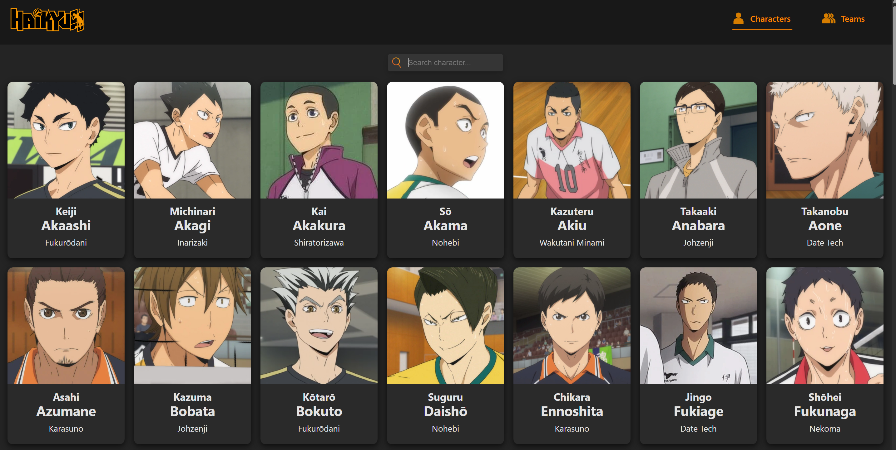
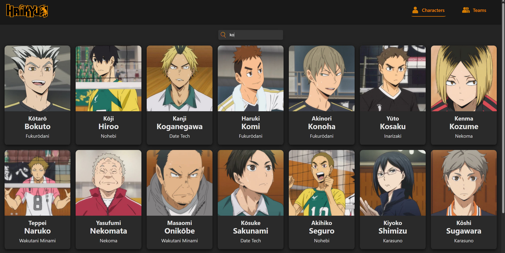
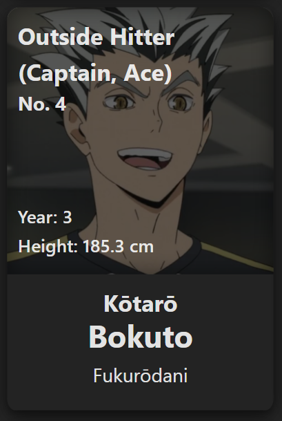
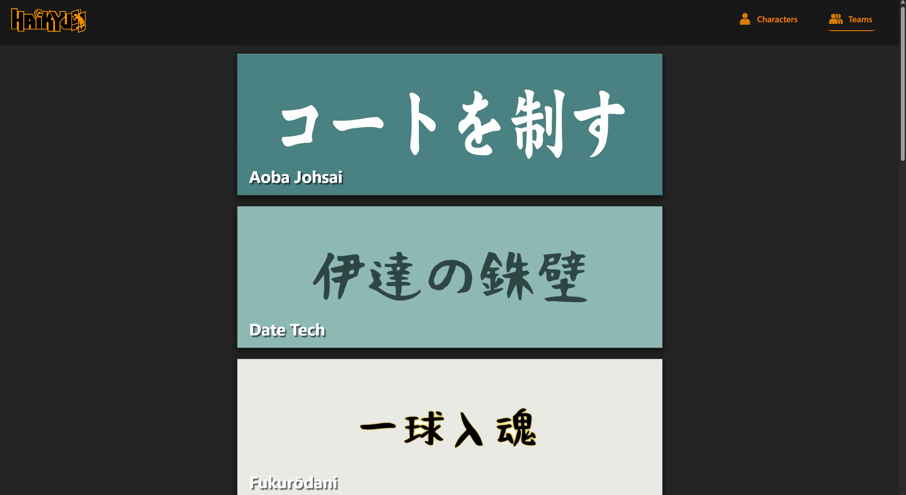

# Haikyuu!! React Web App

A simple React web app built as a learning project. It displays characters and teams from *Haikyuu!!*, with features like searchable character cards and a teams page that brings users to team rosters. The project focuses on building reusable components and practicing key React concepts such as props, state, and conditional rendering.

## 🚀 Live Demo
👉 [Try it now](https://emihuy.github.io/haikyuu/)


## ✨ Features

- **Character Cards:** Browse a full list of *Haikyuu!!* characters with their basic information in clean, reusable cards sorted in alpha order by last name.
- **Hover Details:** Hover over a character card to reveal additional details
- **Search Functionality:** Search characters by name in real time
- **Teams Page:** View  a list of different *Haikyuu!!* volleyball teams in the form of reusable cards, that, when clicked, navigates users to team rosters.
- **Reusable Components:** Built with reusable React components to promote clean and maintainable code.


## 🛠️ Installation

1. Clone the repository:


    ```bash
    git clone https://github.com/emiHuy/haikyuu.git
    ```

2. Navigate to React app folder:

    ```bash
    cd haikyuu/haikyuu-app
    ```

3. Install dependencies:

    ```bash
    npm install
    ```

4. Start the development server:

    ```bash
    npm run dev
    ```

5. Open your browser at the URL shown in the terminal (usually `http://localhost:5173`)


## 🎮 Usage

- Browse the list of characters on the Characters page.
- Use the search bar to filter characters by name instantly.
- Click on any team card on the Teams page to view its roster.
- Hover over a character card to see more details.

## 📁 Project Structure

```bash
haikyuu/ # Root repository folder
└── haikyuu-app/ # React app folder
    ├── node_modules/ # Installed dependencies
    ├── public/
    │   ├── assets/
    │   │ └── images/ # Images used in the app
    ├── src/
    │   ├── components/ # Reusable React components
    │   ├── css/ # CSS stylesheets
    │   ├── data/ # Static data files 
    │   ├── pages/ # Page components 
    │   ├── App.jsx # Root React component
    │   └── main.jsx # React app entry point (rendering App)
    └── index.html # Main HTML file
└── README.md # project info
```

## ℹ️ Project Info

**Project Name:** Haikyuu React App <br>
**Author:** Emily <br>
**Built With:** React, JavaScript, CSS <br>
**Date Created:** June 23, 2025  <br>
**Last Updated:** July 4, 2025 


## 📸 Gallery

### Characters Page


### Character Search


### Character Cards (Right = Hover)
<p>
  
  
</p>

### Teams Page
 

### Team Roster
.png)
.png)